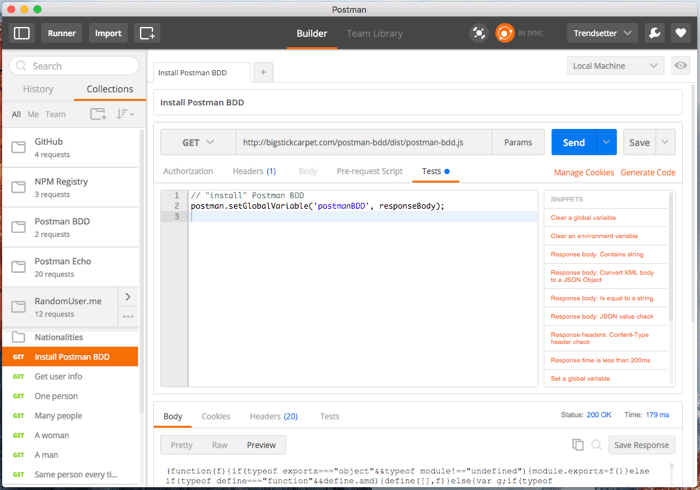
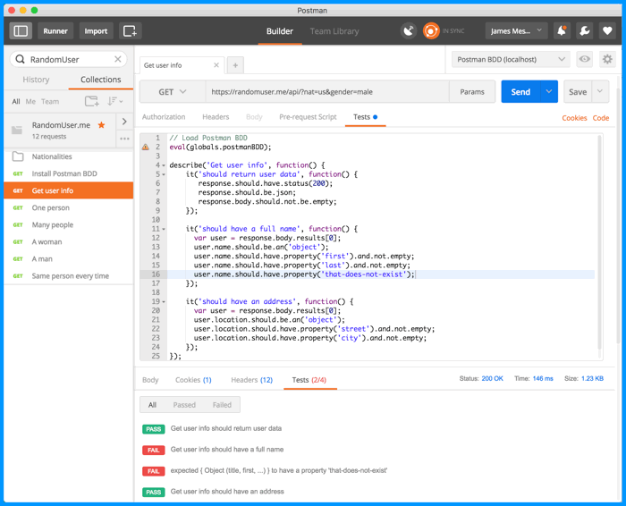
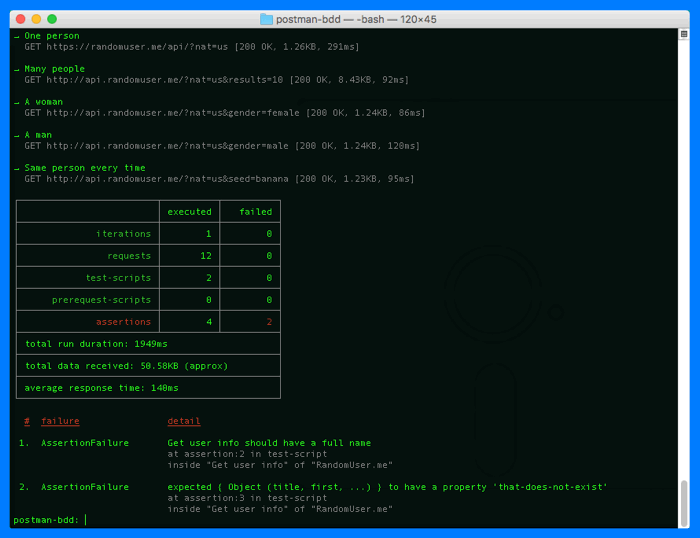

[](https://travis-ci.org/BigstickCarpet/postman-bdd)
[](https://ci.appveyor.com/project/BigstickCarpet/postman-bdd)

[](https://coveralls.io/r/BigstickCarpet/postman-bdd)
[](https://www.codacy.com/public/jamesmessinger/postman-bdd)
[](http://inch-ci.org/github/BigstickCarpet/postman-bdd)
[](https://david-dm.org/BigstickCarpet/postman-bdd)

[](https://www.npmjs.com/package/postman-bdd)
[](http://bower.io/)
[](LICENSE)


Overview
--------------------------
The [Postman REST client](http://getpostman.com) allows you to [write tests](https://www.getpostman.com/docs/writing_tests) for your APIs, such as ensuring that your endpoints return the proper HTTP status codes, headers, and content.  It even has has a built-in [test runner](https://www.getpostman.com/docs/running_collections) that makes it easy to run all of your tests and immediately see the results.  And you can use the [Newman command-line tool](https://www.getpostman.com/docs/newman_intro) to automate your tests and integrate them into your CI and deployment pipeline.

Postman's built-in test framework uses a boolean-flag syntax for testing, like this:

```javascript
tests['The correct response code was returned'] = responseCode.code === 200;
tests['The Location header is set'] = postman.getResponseHeader('Location');
tests['The Content-Type is JSON'] = postman.getResponseHeader('Content-Type') === 'application/json';
tests['The response has an ID property'] = JSON.parse(responseBody).id = 12345;
```

But Postman BDD allows you to use BDD syntax to structure your tests and [fluent Chai-JS syntax](http://chaijs.com/api/bdd/) to write assertions. So the above test suite could look like this instead:

```javascript
describe('Get customer info', () => {

  it('should return a 200 response', () => {
    response.should.have.status(200);
  });

  it('should set the Location header', () => {
    response.should.have.header('Location');
  });

  it('should return a JSON response', () => {
    response.should.be.json;
  });

  it('should return the correct customer', () => {
    response.body.should.have.property('id', 12345);
  });

});
```


Features & Benefits
--------------------------
- **BDD & fluent syntax**<br>
Makes tests easier to write and read

- **BDD Hooks**<br>
Use `before`, `after`, `beforeEach`, and `afterEach` hooks to reuse code and tests

- **Automatic Error Handling**<br>
If a script error occurs, only that _one_ test fails. Other tests still run.

- **Automatic Response Parsing**<br>
If the response is JSON, then it is automatically parsed for you.  No need to call `JSON.parse()` first.

- **Lots of Assertions**<br>
Full access to all [Chai-JS](http://chaijs.com/api/bdd/) and [Chai-HTTP](http://chaijs.com/plugins/chai-http/#assertions) assertions

- **Custom Assertions**<br>
Define custom Chai-JS assertions for your API to encapsulate logic and make tests more readabile<br>
(e.g. `response.body.should.be.a.customer`)

- **Nested `describe` blocks**<br>
You can nest `describe` blocks to logically group your tests

- **JSON Schema Validation**<br>
Use `response.body.should.have.schema(someJsonSchema)` to validate responses against a [JSON Schema](https://spacetelescope.github.io/understanding-json-schema/basics.html)

- **Detailed logging**<br>
You can increase or decrease the amount of information that Postman BDD logs by setting `postmanBDD.logLevel`. Errors and warnings are logged by default.


Installation
--------------------------
There are two simple steps to installing Postman BDD:

**1. Download Postman BDD**<br>
Create a `GET` request in Postman and point it to the following URL:<br>
[`http://bigstickcarpet.com/postman-bdd/dist/postman-bdd.min.js`](http://bigstickcarpet.com/postman-bdd/dist/postman-bdd.min.js)

**2. Install Postman BDD**<br>
In the same request that you created in Step 1, go to the "Tests" tab and add the following script:

```javascript
// "install" Postman BDD
postman.setGlobalVariable('postmanBDD', responseBody);
```

Here's what that should look like:




Usage
--------------------------
You now have Postman BDD installed globally.  You can use it in any Postman request by "loading" it with the following script:

```javascript
// Load Postman BDD
eval(globals.postmanBDD);
```

After you've loaded Postman BDD, you can write your tests using BDD syntax and [Chai-JS assertions](http://chaijs.com/api/bdd/). Here's an screenshot of [a sample collection](docs/sample_collection.json):




API Documentation
--------------------------
The Postman BDD API is identical to [Chai HTTP's API](https://github.com/chaijs/chai-http#assertions), which is in-turn based on [SuperAgent's API](https://visionmedia.github.io/superagent/#response-properties).

### `response` object
The [`response` object](https://visionmedia.github.io/superagent/#response-properties) is what you'll be doing most of your assertions on.  It contains all the information about your HTTP response, such as [`response.text`](https://visionmedia.github.io/superagent/#response-text), [`response.body`](https://visionmedia.github.io/superagent/#response-body) (for JSON responses), [`response.status`](https://visionmedia.github.io/superagent/#response-status), and even a few shortcut properties like [`response.ok`](https://visionmedia.github.io/superagent/#response-status) and [`response.error`](https://visionmedia.github.io/superagent/#response-status).


### `expect` and `should` assertions
You can use any of the [Chai HTTP assertions](https://github.com/chaijs/chai-http#assertions) via Chai's [`expect` interface](http://chaijs.com/guide/styles/#expect) or [`should` interface](http://chaijs.com/guide/styles/#should).  It's just a matter of personal preference.  For example, the following two assertions are identical:

```javascript
// expect interface
expect(response).to.have.header('content-type', 'application/json');

// should interface
response.should.have.header('content-type', 'application/json');
```

Other assertsions you can do include `response.should.be.html`, `response.should.have.status(200)`, and `response.should.redirectTo("http://example.com")`


Running tests in bulk
--------------------------
The normal Postman UI allows you to test individual requests one-by-one and see the results.  That's great for debugging a specific endpoint or scenario, but if you want to run _all_ of your tests, then you'll want to use Postman's Collection Runner.  To do that, click the "_Runner_" button in the header bar.

Select the collection you want to run, and any other options that you want &mdash; such as an [environment](http://www.getpostman.com/docs/environments), a [data file](http://www.getpostman.com/docs/multiple_instances), or the number of iterations to run.  Then click the "_Start Test_" button.  You'll see the test results on the right-hand side, as well as a pass/fail summary at the top.  You can also click the "info" icon for any request to see detailed test results for that request.


Running tests from the command line
--------------------------
Postman has a command-line test runner called [Newman](http://www.getpostman.com/docs/newman_intro).  If you prefer the CLI instead of a GUI, then this the tool for you.  It's also ideal for [continuous-integration](https://en.wikipedia.org/wiki/Continuous_integration) and [continuous-delivery](https://en.wikipedia.org/wiki/Continuous_delivery) testing.  Just like the Collection Runner, you can run your entire suite of tests, or just a single folder.  You can load data from a file, and even write the test results to an output file in various formats (JSON, XML, HTML)




Contributing
--------------------------
I welcome any contributions, enhancements, and bug-fixes.  [File an issue](https://github.com/BigstickCarpet/postman-bdd/issues) on GitHub and [submit a pull request](https://github.com/BigstickCarpet/postman-bdd/pulls).

#### Building/Testing
To build/test the project locally on your computer:

1. __Clone this repo__<br>
`git clone https://github.com/bigstickcarpet/postman-bdd.git`

2. __Install dependencies__<br>
`npm install`

3. __Run the tests__<br>
`npm test`

4. __Start the local web server__<br>
`npm start` (then browse to [http://localhost:8080/](http://localhost:8080)

5. __Run Postman__<br>
Download it [here](http://getpostman.com/apps) (it's free)

5. __Run the Postman BDD Collection__<br>
Import the [Postman BDD Collection](test/newman/postman_bdd_collection.json), and then use the [Postman BDD (localhost) Environment](test/newman/postman_bdd_localhost_environment.json) or the [Postman BDD (GitHub) Environment](test/newman/postman_bdd_github_environment.json) to run the collection.


License
--------------------------
Postman BDD is 100% free and open-source, under the [MIT license](LICENSE). Use it however you want.
